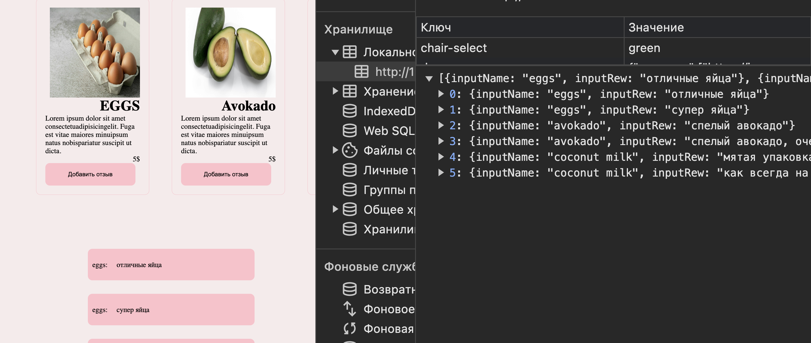

Задание:
Создайте интерактивную веб-страницу для оставления и просмотра отзывов о продуктах. Пользователи могут добавлять отзывы о различных продуктах и просматривать добавленные отзывы.

Приложение умеет: 
1. Загружать данные из data.JS
2. Хранить данные в localStorage
3. Добавлять отзывы
4. Показывать все отзывы
5. Показывать отзывы конкретного продукта при клике на его название.
6. Удалять по клику отзыв со страницы и localStorage

 